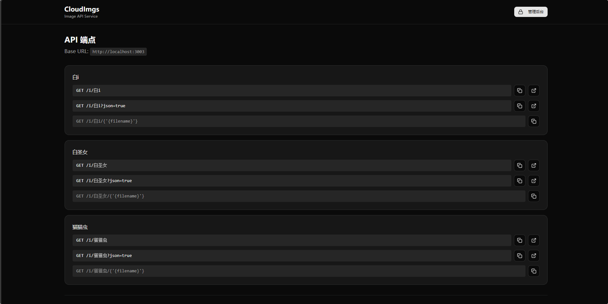

# CloudImgs（云图）

[](https://github.com/a-cold-bird/cloudimgs/stargazers)
[](https://github.com/a-cold-bird/cloudimgs/network/members)
[](https://github.com/a-cold-bird/cloudimgs/releases)

一个自托管的现代图床：上传/管理/相册/分享/开放 API，并支持按 URL 参数进行图片实时处理（尺寸、质量、格式等）。

## 功能

- 开放 API：上传（含 base64）、随机图片、图片列表、删除、SVG 转 PNG、按参数处理图片等
- 管理界面：瀑布流、拖拽多图上传、批量圈选删除、多级目录、相册分享
- 体验优化：ThumbHash 缩略图、移动端适配、多主题
- 安全：可选访问密码（`PASSWORD`）

PicGo 插件：`https://github.com/qazzxxx/picgo-plugin-cloudimgs-uploader`

## Docker Compose（推荐）

本仓库提供 `Dockerfile`，请使用本地构建（无预构建镜像）：

```yaml
services:
  cloudimgs:
    build: .
    container_name: cloudimgs-app
    restart: unless-stopped
    ports:
      - "3003:3003"
    environment:
      - NODE_ENV=production
      - PORT=3003
      - STORAGE_PATH=/app/uploads
      - DATABASE_URL=/app/data/cloudimgs.db
      # 可选：启用访问密码
      # - PASSWORD=your_secure_password_here
      # 可选：NAS 权限映射
      - PUID=1000
      - PGID=1000
      - UMASK=002
    volumes:
      - ./uploads:/app/uploads
      - ./data:/app/data
      - ./logs:/app/logs
```

启动：`docker compose up -d --build`

## 示例截图

主页：



相册：


## 数据持久化

- 上传数据与缓存：挂载 `./uploads:/app/uploads`
- 数据库：挂载 `./data:/app/data`
- 日志：挂载 `./logs:/app/logs`（可选，但建议）

## 相关链接

- 仓库：`https://github.com/a-cold-bird/cloudimgs`
- Docker 部署文档：`DOCKER.md`

## Star History

[](https://www.star-history.com/#a-cold-bird/cloudimgs&type=date&legend=top-left)
